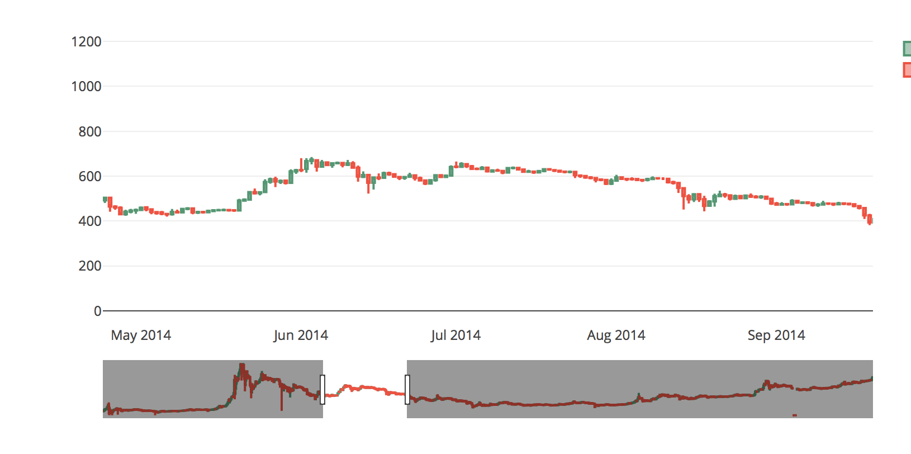

# Machine Learning Final Project
## Trading Algorithm Python 3.5 

Github repository for the machine learning trading algorithm. Still a work in progress. The goal is to use candle sticks in order to determine when to buy or hold a stock. 

### Setup
1. Have pip installed on your [system](https://pip.pypa.io/en/stable/) 
2. Also you will need to install Ta-Lib at C++ Lib(Dependency), checkout [directions](https://github.com/mrjbq7/ta-lib)
3. Run pip install -r requirements.txt, make sure this is for python3, may need to specify pip3
4. Run the command jupyter lab inside src directory
5. Go into the ipython notebook candle stick plot and play around

### To Do
1. Implement optimization algorithm to decide on Q function weights
2. Use these q function weights in order to develop a trading policy
3. Further investigation on ways to improve either of these two

Northeastern University 2018
